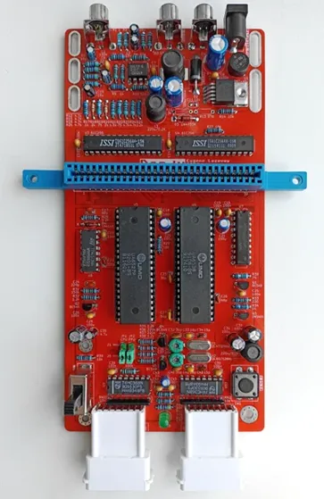
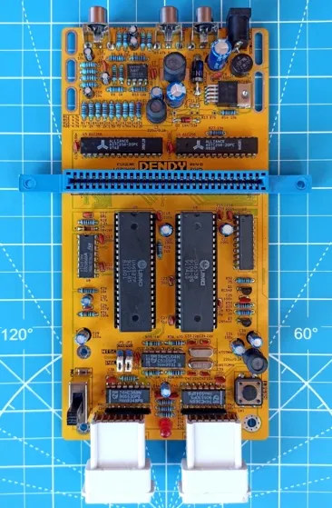

## Dendy
Yet another Dendy (Famicom) clone - 8-bit home video game console

[(more random photos there)](https://cloud.err200.net/index.php/s/73TR85tYZkMm8Ax?path=%2Fdendy)

- PCB optimized for NewGame's case
- Almost all components is DIP (THT)
- 9-12V DC power supply with any polarity
- Step-down switching regulator
- PNP+NPN transistors-based video amplifier
- OpAmp-based audio mixer/amplifier
- Two switchable quartz crystals (PAL+NTSC)

### Changelog & current status
* Rev.A - first release. Please note the [errata](pcb/rev.A/ERRATA.txt)
* Rev.B:
    - Reworked crystal generator circuit
    - Tuned pcb's dimensions and holes placement for better compatibility with enclosures
    - Various minor changes and improvements
* Rev.B1:
    - Power switch moved up to 0.5mm
    - Various minor changes and improvements

### Credits
I want to express my appreciation to the
 - megawalkman
 - HardWareMan
 - lm2000
 - HotPixel

authors of the following projects, which served as inspiration and as reference for my development:

- https://www.emu-land.net/forum/index.php/topic,75737.0.html - Dendy Classic/Junior Steepler Remake
- https://www.emu-land.net/forum/index.php/topic,78815.0.html - Dendy Junior Remastered
- https://github.com/mleonid2000/dendy_junior_remastered - Dendy Junior Remastered
- https://github.com/HotPixelChannel/Candy_8bit - Candy 8bit system
